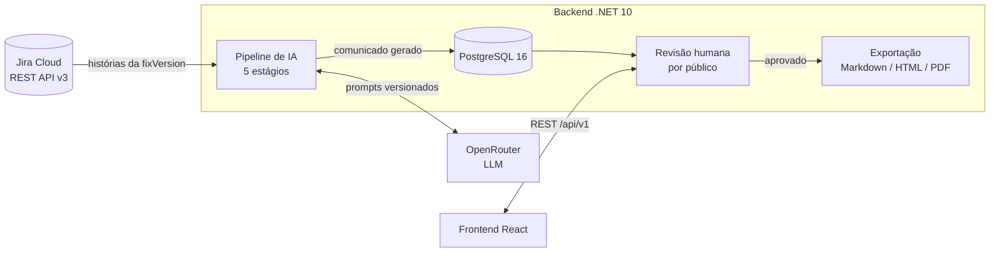
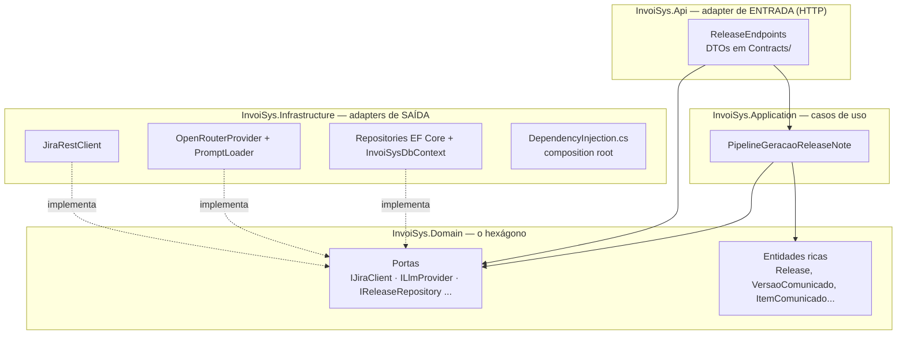
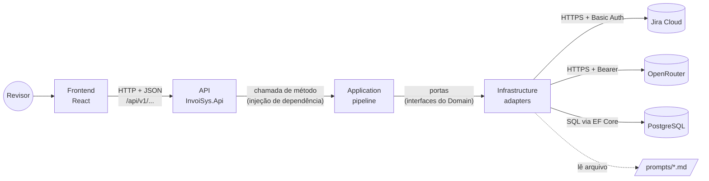
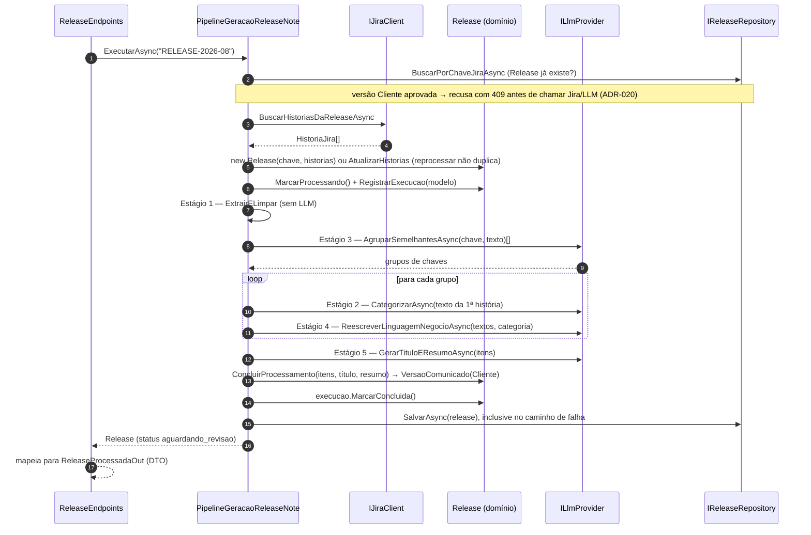
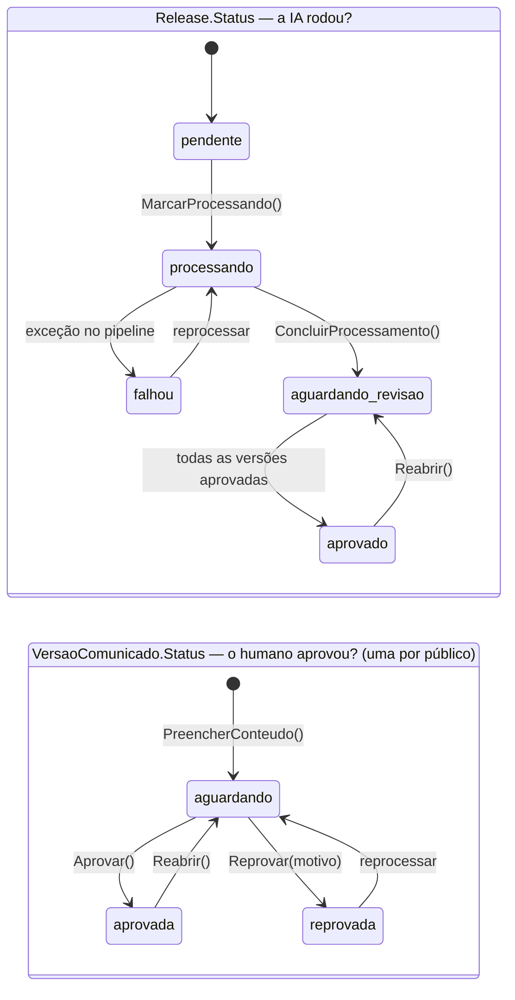

# Squad 78 — InvoiSys · Release Notes via IA

Residência IV. Sistema que lê as histórias de uma Release no **Jira**, processa tudo com
**IA** e entrega um **comunicado de Release (Release Notes)** em linguagem de negócio,
organizado por categoria. Nada é publicado sem **revisão e aprovação humana**.

Este README explica **o que cada parte faz, como elas se comunicam e como o dado
percorre o sistema**. O que já está pronto e o que falta está em
[O que está pronto e o que falta](#o-que-está-pronto-e-o-que-falta).

---

## Índice

- [O problema](#o-problema)
- [Visão geral em 30 segundos](#visão-geral-em-30-segundos)
- [Arquitetura — hexagonal, e por quê](#arquitetura--hexagonal-e-por-quê)
- [Como as partes se comunicam](#como-as-partes-se-comunicam)
- [O fluxo completo, passo a passo](#o-fluxo-completo-passo-a-passo)
- [Como o dado percorre o sistema](#como-o-dado-percorre-o-sistema)
- [Ciclo de vida: geração × revisão](#ciclo-de-vida-geração--revisão)
- [Mapa dos módulos](#mapa-dos-módulos)
- [Invariantes de negócio](#invariantes-de-negócio)
- [O que está pronto e o que falta](#o-que-está-pronto-e-o-que-falta)
- [Rodando o projeto](#rodando-o-projeto)
- [Configuração](#configuração)
- [Documentação complementar](#documentação-complementar)
- [Enunciado original do desafio](#enunciado-original-do-desafio)

---

## O problema

A InvoiSys (SaaS de gestão de Documentos Fiscais Eletrônicos) publica, a cada Release,
um card no Jira com todas as histórias da versão. Hoje, uma pessoa:

1. lê história por história;
2. decide o que interessa ao cliente e o que é detalhe interno;
3. junta itens que falam da mesma coisa;
4. traduz linguagem técnica para linguagem de negócio;
5. escreve título, resumo e o comunicado final.

O processo é lento, inconsistente e depende de quem escreve. Este projeto automatiza os
passos 1 a 5 com IA e mantém a decisão final com um humano.

---

## Visão geral em 30 segundos



| Etapa | O que acontece | Status |
|---|---|---|
| **Ingestão** | Busca no Jira todas as issues da Release (`fixVersion`), com o texto da subtarefa "Release Note" quando existir | ✅ implementado |
| **Pipeline de IA** | Limpa → agrupa semelhantes → categoriza → reescreve em linguagem de negócio → gera título e resumo | ✅ implementado (testado com fakes; falta validar com LLM real) |
| **Persistência** | Grava Release, histórias, comunicado e log da execução | ✅ implementado (reprocessar reaproveita a Release; versão aprovada exige reabrir) |
| **Revisão** | Humano vê, edita, exclui itens, aprova ou reprova, **por público-alvo** | 🔶 domínio pronto, falta API (#21–#23) e tela |
| **Exportação** | Gera Markdown (HTML/PDF como diferencial) só de versão aprovada | ✅ Markdown implementado (`POST /releases/{chave}/exportar`); HTML/PDF pendentes |
| **Autenticação** | Login JWT de quem revisa e aprova | ❌ só a entidade `Usuario` e o repository |

---

## Arquitetura — hexagonal, e por quê

O backend segue **Ports & Adapters (arquitetura hexagonal)**. O centro, o domínio, não
conhece nada de fora: nem HTTP, nem JSON, nem banco, nem Jira, nem LLM. Tudo o que é
externo entra por uma **porta** (interface definida no domínio) e é implementado por um
**adapter** na infraestrutura.



**Direção das dependências** (garantida pelos `.csproj`, não só por convenção):

```
Api ──► Application ──► Domain ◄── Infrastructure
 └──────────────────────────────────────┘ (só Program.cs, para registrar a DI)
```

### Por que hexagonal neste projeto

| Motivo | Na prática |
|---|---|
| **As duas integrações centrais são incertas** | O Jira real da InvoiSys ainda não foi validado (o nome exato do subtask type "Release Note" é pendência) e o modelo de LLM pode mudar. Como o pipeline depende de `IJiraClient`/`ILlmProvider`, trocar ou corrigir um adapter não toca em regra de negócio. |
| **Testar sem rede e sem custo de token** | A suíte unitária injeta `FakeJiraClient` e `FakeLlmProvider`. O pipeline inteiro roda em milissegundos, de forma determinística, sem chave de API. |
| **O invariante mais importante precisa ser inviolável** | "Nada publica sem aprovação humana" vive *dentro* da entidade (`VersaoComunicado.Aprovar()`), não num `if` do endpoint. Não importa por qual caminho o código chegue, o gate está lá. |
| **Ambiente sem credencial não pode mentir** | Sem chave, o composition root entrega `ProviderPendente`/`JiraClientPendente`, que respondem **501 com a instrução do que configurar**, em vez de um 500 opaco ou de um resultado falso. |
| **Migração de stack sem redesenho** | O backend nasceu em Python/FastAPI e foi portado para .NET 10. Como o desenho era hexagonal, a migração trocou a linguagem e manteve as fronteiras. |

A decisão completa, com alternativas descartadas, está em
[docs/decisoes-arquiteturais.md](docs/decisoes-arquiteturais.md#adr-001--arquitetura-hexagonal-ports--adapters).

---

## Como as partes se comunicam

O sistema tem **cinco peças** conversando entre si, e cada conversa tem um único canal:



| De → Para | Canal | Formato | O que trafega | Quem define o contrato |
|---|---|---|---|---|
| Frontend → API | HTTP REST | JSON (enums em `snake_case`, ex.: `nova_funcionalidade`) | pedidos de busca, processamento, revisão, exportação | DTOs em `InvoiSys.Api/Contracts` + spec OpenAPI (`/openapi/v1.json`) |
| API → Application | chamada de método em processo | objetos C# | "processe a Release X" | assinatura de `PipelineGeracaoReleaseNote` |
| API/Application → Domain | chamada de método em processo | entidades do domínio | aprovar, reprovar, editar item… | métodos das entidades (`Release.Aprovar`, …) |
| Application → Infrastructure | **portas** (interfaces) resolvidas pela DI | entidades do domínio | "me dê as histórias", "categorize este texto", "salve esta Release" | interfaces em `InvoiSys.Domain/Ports` |
| Infrastructure → Jira | HTTPS REST v3 | JSON (descrição em ADF) | issues da `fixVersion` e subtarefas Release Note | API da Atlassian ([contrato](docs/contratos-integracao.md)) |
| Infrastructure → OpenRouter | HTTPS (Chat Completions) | JSON no schema OpenAI | prompt montado → resposta texto/JSON | API da OpenRouter ([contrato](docs/contratos-integracao.md)) |
| Infrastructure → Postgres | TCP (Npgsql) | SQL gerado pelo EF Core | o agregado `Release` e suas filhas | migrations em `Infrastructure/Database/Migrations` |
| Infrastructure → prompts | leitura de arquivo | Markdown com `{{placeholders}}` | texto de cada estágio | arquivos em `prompts/` |

**Três regras mantêm essa comunicação organizada:**

1. **Quem está dentro nunca chama quem está fora diretamente.** O pipeline não sabe que
   existe um `HttpClient` ou um banco; ele chama `IJiraClient`, `ILlmProvider`,
   `IReleaseRepository`. Quem decide qual implementação responde é
   `Infrastructure/DependencyInjection.cs`, o único lugar que liga porta a adapter.
2. **Entidade de domínio não sai pela API.** O endpoint sempre converte para um DTO.
   Assim o domínio pode mudar sem quebrar o frontend.
3. **Erro também é contrato.** Falha externa vira exceção definida no domínio
   (`JiraApiException`, `LlmApiException`, …), e a API a traduz em HTTP (502 ou 501).
   Nenhuma exceção crua de biblioteca deveria chegar ao frontend.

**Configuração** chega por variável de ambiente ou `appsettings.json`, é lida só pela
Infrastructure (`JiraOptions`, `OpenRouterOptions`, connection string) e nunca
diretamente pelo domínio. Ver [Configuração](#configuração).

---

## O fluxo completo, passo a passo

### 1. Conferir o que vem do Jira (sem gastar token)

`GET /api/v1/releases/{chaveRelease}/historias`

```
ReleaseEndpoints.BuscarHistoriasAsync
  └─► IJiraClient.BuscarHistoriasDaReleaseAsync(fixVersion)
        └─► JiraRestClient
              ├─ GET /rest/api/3/search/jql?jql=fixVersion="X"   (pagina por nextPageToken, 100 por página)
              ├─ para cada issue com subtarefa do tipo "Release Note":
              │     GET /rest/api/3/issue/{key}?fields=description
              └─ ADF (Atlassian Document Format) → texto puro → HistoriaJira
  ◄── ReleaseOut { chaveJira, status: "pendente", totalHistorias, historias[] }
```

Serve para o revisor ver o que vai entrar no processamento antes de rodar a IA.

### 2. Rodar o pipeline de IA

`POST /api/v1/releases/{chaveRelease}/processar` →
`PipelineGeracaoReleaseNote.ExecutarAsync(chaveRelease)`



**Os 5 estágios:**

| # | Estágio | Quem faz | Método | Prompt |
|---|---|---|---|---|
| 1 | Extração e limpeza | código C# (determinístico, **não** chama LLM) | `PipelineGeracaoReleaseNote.ExtrairELimpar` | — |
| 2 | Categorização | LLM | `ILlmProvider.CategorizarAsync` | [02_categorizar.md](prompts/02_categorizar.md) |
| 3 | Agrupamento semântico | LLM | `ILlmProvider.AgruparSemelhantesAsync` | [03_agrupar_semelhantes.md](prompts/03_agrupar_semelhantes.md) |
| 4 | Reescrita em linguagem de negócio | LLM | `ILlmProvider.ReescreverLinguagemNegocioAsync` | [04_reescrever_linguagem_negocio.md](prompts/04_reescrever_linguagem_negocio.md) |
| 5 | Título e resumo executivos | LLM | `ILlmProvider.GerarTituloEResumoAsync` | [05_gerar_titulo_resumo.md](prompts/05_gerar_titulo_resumo.md) |

> A numeração segue o desenho conceitual. Na execução, o **agrupamento (3) roda antes da
> categorização (2)**: categoriza-se o *grupo*, não cada história. Isso economiza chamadas
> e garante que histórias fundidas compartilhem a mesma categoria.

**Custo em chamadas ao LLM** para uma Release com *G* grupos: `1 (agrupar) + 2·G
(categorizar + reescrever) + 1 (título/resumo)`.

**Proteções contra resposta ruim do modelo** (IA não é confiável por padrão):

- chave **alucinada** pelo LLM (que nunca veio do Jira) → descartada no pipeline;
- chave real **esquecida** no agrupamento → reinserida como grupo próprio, com log de
  aviso (história real nunca some do comunicado);
- JSON embrulhado em ```` ```json ```` → extraído antes do parse;
- categoria fora do enum, JSON malformado, campo ausente → `LlmRespostaInvalidaException`
  → HTTP 502 com causa legível;
- temperatura 0.2 (consistência acima de criatividade).

### 3. Revisão humana *(domínio pronto, API pendente: #21, #22, #23)*

Tudo já está implementado **como métodos do domínio**; falta expor por HTTP:

| Ação do revisor | Método do domínio | Regra que o método garante |
|---|---|---|
| Aprovar a versão de um público | `Release.Aprovar(aprovadoPor, agora, publico)` → `VersaoComunicado.Aprovar` | Exige itens, ao menos 1 item não excluído, e status `aguardando_revisao`. Release só vira `aprovado` quando **todas** as versões estão aprovadas |
| Reprovar | `Release.Reprovar(revisadoPor, motivo, agora, publico)` | Motivo obrigatório (também garantido por CHECK no banco) |
| Reabrir algo já aprovado | `Release.Reabrir(publico)` | Só reabre o que está aprovado; exportações anteriores **não** são apagadas |
| Editar texto de um item | `Release.EditarItem(itemId, texto)` → `PATCH .../itens/{itemId}` | `TextoFinal` sempre prioriza a edição humana; versão aprovada não muda sem reabrir ([ADR-021](docs/decisoes-arquiteturais.md#adr-021--item-de-versão-aprovada-não-é-editado-sem-reabrir)) |
| Tirar item do comunicado | `Release.ExcluirItem(itemId, motivo)` / `ReincluirItem(itemId)` → `POST .../excluir` · `.../reincluir` | Não apaga o registro: o que a IA gerou continua auditável |

Toda mutação passa pela `Release` carregada via `IReleaseRepository`, porque
`VersaoComunicado` e `ItemComunicado` **não têm repository próprio** (ver
[ADR-009](docs/decisoes-arquiteturais.md#adr-009--repository-por-agregado-portas-de-leitura-isoladas)).

### 4. Exportação *(Markdown implementado em #24; HTML/PDF pendentes)*

`new ComunicadoExportado(versao, formato, conteudo, caminhoArquivo, geradoPor)` **lança
`ReleaseNaoAprovadaException`** se a versão não estiver `ProntaParaExportar`. Não existe
instância inválida. A gravação é **append-only** (`IComunicadoExportadoRepository`):
reexportar é um evento novo, nunca um UPDATE. O render deve usar
`VersaoComunicado.ItensPublicaveis` e `ItemComunicado.TextoFinal`, nunca `Itens` e
`Texto` crus.

---

## Como o dado percorre o sistema

Cada fronteira troca a representação do dado, e cada troca tem um dono.

| # | Onde | Forma do dado | Quem converte |
|---|---|---|---|
| 1 | Jira Cloud | JSON da API v3; `description` em **ADF** (árvore de nós) | — |
| 2 | `JiraRestClient` | `JsonElement` → **`HistoriaJira`** (record imutável; ADF achatado em texto) | `ParaHistoriaJira`, `ExtrairTextoAdf` |
| 3 | Domínio | `HistoriaJira.TextoFonte` = texto da subtarefa Release Note **se existir**, senão a descrição técnica | propriedade da entidade |
| 4 | Pipeline, estágio 1 | cópia limpa da história (`with { ... }`, espaços colapsados), sem mutar a original | `ExtrairELimpar` |
| 5 | `OpenRouterProvider` | prompt `.md` com `{{placeholders}}` → `ChatCompletionRequest` (schema OpenAI) → resposta texto/JSON | `PromptLoader.Montar`, `ChamarAsync` |
| 6 | Pipeline | grupos de chaves → **`ItemComunicado`** (categoria, texto, `Origens` = chaves Jira) | `ProcessarGruposAsync` |
| 7 | Domínio | itens + título + resumo → **`VersaoComunicado`** (uma por público; hoje só Cliente) | `Release.ConcluirProcessamento` |
| 8 | EF Core | agregado `Release` → 5 tabelas (`releases`, `historias_jira`, `versoes_comunicado`, `itens_comunicado`, `execucoes_pipeline`); enums viram texto `snake_case`; listas viram `text[]` | configurations em `Infrastructure/Database/Configurations` |
| 9 | API | entidade → **DTO** (`ReleaseProcessadaOut`); enums saem como `"nova_funcionalidade"`, `"aguardando_revisao"` | `ReleaseEndpoints` |
| 10 | Exportação *(futuro)* | `VersaoComunicado` aprovada → Markdown → `ComunicadoExportado` (append-only) | `ExportacaoComunicado` + `RenderizadorMarkdown` (#24) |

**Erros também percorrem as camadas de forma controlada:**

```
HttpClient falha ──► policy de retry (3 tentativas, backoff exponencial, circuit breaker)
                 ──► adapter lança exceção DO DOMÍNIO (JiraApiException / LlmApiException /
                     LlmRespostaInvalidaException), com o corpo da resposta externa SÓ no log
                 ──► pipeline marca Release e ExecucaoPipeline como falhou, com o motivo
                 ──► endpoint traduz: IntegracaoExternaException → 502,
                                     ProviderNaoConfiguradoException → 501
```

> ⚠️ **Limitação atual:** a tradução acima vale quando o
> serviço externo **responde** com erro HTTP. Falha de **transporte** (DNS, conexão
> recusada, timeout ou circuit breaker do Polly) ainda escapa como `HttpRequestException`
> crua e vira **500** (ex.: `Jira__BaseUrl` apontando para um host inexistente).
> Correção prevista: capturar essas exceções em `JiraRestClient.GetAsync` e
> `OpenRouterProvider.PostAsync` e relançar como `JiraApiException`/`LlmApiException`.

---

## Ciclo de vida: geração × revisão

São **dois eixos de status independentes**. Um enum só não representaria "Cliente
aprovado, Suporte ainda em ajuste".



Cada execução do pipeline gera uma linha em `execucoes_pipeline` (`iniciada` →
`concluida` | `falhou`, com modelo usado e erro). O histórico nunca é sobrescrito.

---

## Mapa dos módulos

Cada parte tem o próprio README, com responsabilidades, classes e métodos principais e o
que falta:

| Módulo | README | Em uma linha |
|---|---|---|
| `src/InvoiSys.Domain` | [README](src/InvoiSys.Domain/README.md) | Entidades ricas, enums de negócio, portas e o contrato de erro. Zero dependência externa |
| `src/InvoiSys.Application` | [README](src/InvoiSys.Application/README.md) | O caso de uso `PipelineGeracaoReleaseNote`, que orquestra os 5 estágios |
| `src/InvoiSys.Infrastructure` | [README](src/InvoiSys.Infrastructure/README.md) | Adapters de Jira, OpenRouter e EF Core/Postgres, mais o composition root |
| `src/InvoiSys.Api` | [README](src/InvoiSys.Api/README.md) | Minimal API: endpoints, DTOs, tradução de erro em HTTP, health check, OpenAPI |
| `src/` (visão do backend) | [README](src/README.md) | Como as 4 camadas se encaixam |
| `tests-dotnet/` | [README](tests-dotnet/README.md) | Testes unitários com fakes das portas e integração com Postgres real (Testcontainers) |
| `frontend/` | [README](frontend/README.md) | React 19 + Vite + Tailwind. Hoje: login e recuperação de senha, ainda com mock |
| `prompts/` | [README](prompts/README.md) | Um prompt por estágio de IA, versionado como arquivo |
| `docs/` | [README](docs/README.md) | Decisões (ADRs), modelagem de dados, contratos de integração |

---

## Invariantes de negócio

Regras que o **código garante** (não dependem de disciplina de quem programa):

1. **Revisão humana obrigatória, por público.** Só `VersaoComunicado.Aprovar()` leva a
   `aprovado`. Aprovar o Cliente não libera o Suporte.
2. **Exportar sem aprovação é impossível.** O construtor de `ComunicadoExportado` rejeita.
3. **Categorias fixas:** `nova_funcionalidade`, `melhoria`, `correcao`, `outros` (enum +
   CHECK no banco).
4. **Subtarefa Release Note tem prioridade** sobre a descrição técnica
   (`HistoriaJira.TextoFonte`).
5. **Edição humana vence a IA** (`ItemComunicado.TextoFinal`).
6. **Nenhuma história real se perde** no agrupamento; nenhuma inventada entra.
7. **Fonte de dados é só a API real do Jira**, sem fallback de JSON/CSV colado.
8. **A IA não sobrescreve o que um humano aprovou:** reprocessar uma versão aprovada
   exige reabrir a revisão antes (a API responde 409).
9. **Auditoria não se reescreve:** `execucoes_pipeline` e `comunicados_exportados` só
   crescem; FK `RESTRICT` protege exportações de DELETE em cascata.

---

## O que está pronto e o que falta

Prazo alvo: **2026-12-31**. O MVP é construído em fatias verticais: primeiro um caminho
ponta a ponta mínimo (Jira → IA → revisão → Markdown), depois os diferenciais.

### ✅ Fase 0 — Fundação *(concluída)*

- Domínio rico com os invariantes acima, cobertos por testes unitários.
- Pipeline de 5 estágios orquestrado e testado com fakes.
- Adapter real do Jira (search/jql + nextPageToken + ADF) e da OpenRouter (fallback
  entre modelos, JSON mode, parsing defensivo).
- Schema Postgres (8 tabelas, CHECKs, triggers `atualizado_em`, 3 migrations) e todos
  os repositories, testados contra Postgres real.
- Docker multi-stage, compose com migração automática, CI (build + format + testes +
  lint/build do front), `main`/`develop` protegidas.

### ✅ Fase 1 — Persistência real do pipeline · issue #20 *(concluída)*

- O pipeline passa a buscar a Release pela chave (reprocessar não duplica).
- `Release.AtualizarHistorias` troca as histórias no reprocessamento.
- O resultado é salvo também no caminho de falha: a `ExecucaoPipeline` com erro fica no
  banco.
- Versão já aprovada só é reprocessada depois de reaberta (409 na API, [ADR-020](docs/decisoes-arquiteturais.md#adr-020--versão-aprovada-não-é-reprocessada-sem-reabrir)).

### ⬜ Fase 2 — API de revisão e exportação · issues #21–#24

| Issue | Endpoint(s) previstos | Apoia-se em |
|---|---|---|
| #21 | `GET /api/v1/releases`, `GET /api/v1/releases/{chave}` (com versões e itens) | `IReleaseRepository` |
| #22 | aprovar / reprovar / reabrir **por público** | `Release.Aprovar/Reprovar/Reabrir` |
| #23 ✅ | editar / excluir / reincluir item | `Release.EditarItem/ExcluirItem/ReincluirItem` |
| #24 | exportar Markdown | `ComunicadoExportado` + `IComunicadoExportadoRepository` |

Junto com isso: DTOs que exponham múltiplos públicos (hoje a API só mostra o atalho da
versão Cliente) e mapeamento das exceções de domínio de revisão
(`RevisaoHumanaObrigatoriaException`, `ReleaseSemItensProcessadosException`,
`ReleaseNaoAprovadaException`) para 409/422.

### ⬜ Fase 3 — Autenticação e integração com o frontend

- `POST /auth/login` com JWT, hash de senha (bcrypt/argon2), endpoints que o front já
  espera (`/auth/me`, `/auth/logout`, `/auth/forgot-password`).
- `revisado_por`/`gerado_por` deixam de ser texto livre e passam a FK de `usuarios`.
- `GET /branding/highlights` (repository `IDestaqueHeroRepository` já existe).
- **CORS** na API (hoje não configurado: o front em `:5173` não consegue chamar `:8080`).
- Trocar os mocks de `frontend/src/services/*` por `fetch` real.

### ⬜ Fase 4 — Interface de revisão (requisito obrigatório do enunciado)

- Lista de Releases → tela da Release com versão por público, itens por categoria,
  edição inline, excluir/reincluir, aprovar/reprovar, exportar.
- Roteamento real (`react-router-dom`), guarda de rota autenticada.
- Telas de dashboard, gestão de usuários e histórico de envios (em desenvolvimento).

### ⬜ Fase 5 — Validação com dados reais

- Rodar contra o **Jira real da InvoiSys**: confirmar o nome do subtask type
  "Release Note" e ampliar a extração de ADF (listas, tabelas) se necessário.
- Rodar contra a **OpenRouter real** ponta a ponta e escolher o modelo.
- Trocar os few-shot genéricos dos prompts por **exemplos reais** de Releases anteriores.

### ⬜ Fase 6 — Diferenciais

- Gerar as versões **Comercial / Suporte / Interno** (o domínio já suporta, o
  orquestrador só chama para Cliente) com prompt por público.
- Exportação **HTML e PDF**.
- Métricas de qualidade da geração (dashboard).
- Opcional: envio por Teams/e-mail.

### ⬜ Entrega final

- Documentação técnica (este repositório) + documentação funcional/UML.
- Guia de instalação e execução (seção abaixo).
- Demo ponta a ponta: Release real do Jira → comunicado revisado → Markdown exportado.

---

## Rodando o projeto

**Pré-requisitos:** .NET SDK 10, Node 22, Docker (para o Postgres e para os testes de
integração).

### Tudo via Docker (mais simples)

```bash
cp .env.example .env        # preencha Jira__* e OpenRouter__ApiKey para usar as integrações
docker compose up --build   # API em http://localhost:8080, Postgres em :5432
curl http://localhost:8080/health
```

O compose aplica as migrations sozinho ao subir (`Database__MigrarAoIniciar=true`).

### Backend local

```bash
docker compose up -d db                 # só o Postgres
dotnet restore InvoiSys.slnx
dotnet build InvoiSys.slnx
dotnet run --project src/InvoiSys.Api   # http://localhost:5049
```

Com a API rodando em Development:

- **Swagger UI** (explorar e testar as rotas no navegador): `http://localhost:5049/swagger`
- Contrato OpenAPI em JSON: `http://localhost:5049/openapi/v1.json`

### Frontend

```bash
cd frontend
npm ci
npm run dev      # http://localhost:5173
```

### Testes e formatação

```bash
dotnet test InvoiSys.slnx      # unitários + integração (sobe Postgres via Testcontainers)
dotnet format InvoiSys.slnx    # o CI reprova com --verify-no-changes
cd frontend && npm run lint && npm run build
```

### Migrations

```bash
dotnet ef migrations add <Nome> --project src/InvoiSys.Infrastructure --startup-project src/InvoiSys.Api --output-dir Database/Migrations
dotnet ef database update --project src/InvoiSys.Infrastructure --startup-project src/InvoiSys.Api
```

---

## Configuração

O .NET lê `appsettings.json` e variáveis de ambiente. **O separador de seção em variável
de ambiente é `__` (dois underscores).**

| Variável | Para quê | Sem ela |
|---|---|---|
| `ConnectionStrings__Default` | Postgres | a API sobe, mas qualquer acesso ao banco falha |
| `Jira__BaseUrl`, `Jira__Email`, `Jira__ApiToken` | Jira Cloud (Basic Auth com **API token**) | endpoints respondem **501** "Jira não configurado" |
| `OpenRouter__ApiKey` | LLM | `/processar` responde **501** "Nenhum LLM provider configurado" |
| `OpenRouter__Modelo` | modelo `provedor/modelo` (padrão `openai/gpt-4o-mini`) | usa o padrão |
| `OpenRouter__ModelosFallback__0`, `__1`… | modelos alternativos, tentados pela própria OpenRouter em 5xx/429 | sem fallback |
| `Database__MigrarAoIniciar` | aplica migrations no startup (ligado no compose, desligado por padrão) | não migra |
| `VITE_API_BASE_URL` (front) | base da API | `http://localhost:8080/api/v1` |

Modelo completo em [.env.example](.env.example).

---

## Documentação complementar

| Documento | Conteúdo |
|---|---|
| [docs/decisoes-arquiteturais.md](docs/decisoes-arquiteturais.md) | **Todas as decisões (ADRs)**: contexto, alternativas, consequências |
| [docs/modelagem-de-dominio.md](docs/modelagem-de-dominio.md) | ERD, tabela por tabela, índices, constraints, triggers |
| [docs/contratos-integracao.md](docs/contratos-integracao.md) | Contratos Jira e OpenRouter: o que foi verificado × o que é pendência |
| [AGENTS.md](AGENTS.md) | Regras para qualquer agente de IA (e humano) que for mexer no código |
| [CONTRIBUTING.md](CONTRIBUTING.md) | Fluxo de branches, PR e CI |

---

## Enunciado original do desafio

<details>
<summary>Clique para expandir</summary>

A InvoiSys é uma empresa especializada em soluções SaaS para gestão de Documentos Fiscais
Eletrônicos (DF-e), atendendo clientes de diversos segmentos do mercado.

A cada nova versão (Release) do produto é criado um card no Jira contendo todas as histórias,
correções, melhorias e novas funcionalidades que serão disponibilizadas aos clientes. Algumas
dessas histórias possuem uma subtarefa específica do tipo Release Note, enquanto outras
possuem apenas a descrição técnica da implementação.

Atualmente, a elaboração dos comunicados enviados aos clientes é um processo manual, exigindo
que um colaborador leia todas as histórias da Release, identifique quais alterações são
relevantes para o cliente, consolide as informações, adapte a linguagem técnica para uma
comunicação de negócio e produza um comunicado final.

**Desafio:** desenvolver uma solução baseada em Inteligência Artificial capaz de automatizar
esse processo. A solução deve consumir as informações da Release (preferencialmente via API
do Jira), interpretar as histórias relacionadas à versão publicada, identificar
automaticamente funcionalidades, correções e melhorias relevantes, e gerar comunicados
claros, organizados e direcionados ao público final.

A IA deve ser capaz de:
- Interpretar descrições técnicas das histórias.
- Utilizar informações existentes nas subtarefas de Release Note quando disponíveis.
- Resumir funcionalidades semelhantes.
- Eliminar informações duplicadas.
- Adaptar o texto para uma linguagem de negócio.
- Organizar os comunicados por categorias (Novas Funcionalidades, Melhorias, Correções, etc.).
- Sugerir títulos e resumos executivos da Release.
- Permitir revisão humana antes da publicação.

**Diferenciais possíveis:** versões diferentes do comunicado (cliente, equipe interna,
comercial e suporte); geração em Markdown, HTML ou PDF.

**Entregáveis esperados:** aplicação funcional; integração com a API do Jira;
processamento com IA; Release Notes em linguagem de cliente; organização por categorias;
interface simples de visualização e revisão; código-fonte; documentação técnica;
documentação funcional; guia de instalação e execução.

**Opcionais:** exportação HTML/Markdown/PDF; integração com Teams ou e-mail; prompts por
público; dashboard com métricas de qualidade da geração.

</details>
