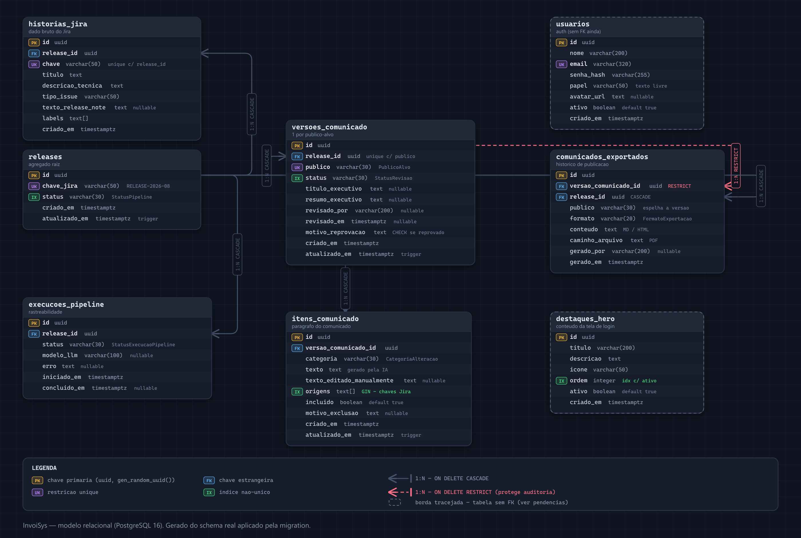
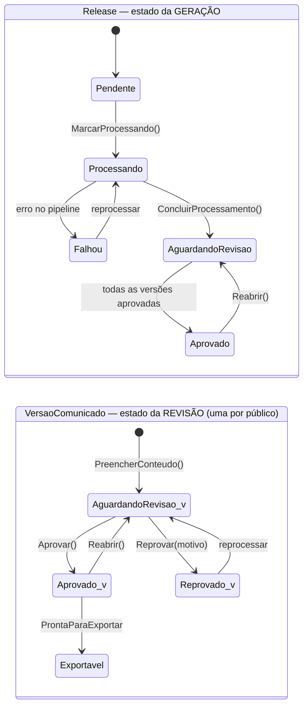

# InvoiSys — Modelagem de Dados e Domínio

Referência completa do modelo: entidades, tabelas, colunas, índices, chaves estrangeiras,
constraints e as decisões por trás deles.

O código é a fonte de verdade — este documento explica o **porquê**, que o código sozinho
não conta. Entidades em [`src/InvoiSys.Domain/Entities/`](../src/InvoiSys.Domain/Entities/),
mapeamento em [`src/InvoiSys.Infrastructure/Database/`](../src/InvoiSys.Infrastructure/Database/).

- **SGBD**: PostgreSQL 16
- **ORM**: EF Core 10 (Code-First) + Npgsql + EFCore.NamingConventions
- **Convenção**: `snake_case` no SQL, `PascalCase` em C# — a naming convention traduz
- **8 tabelas · 66 colunas · 6 chaves estrangeiras · 20 índices**

---

## Índice

- [O problema que a modelagem resolve](#o-problema-que-a-modelagem-resolve)
- [ERD](#erd)
- [Mapa de relacionamentos](#mapa-de-relacionamentos)
- [Fluxo de estados](#fluxo-de-estados)
- [As tabelas, uma a uma](#as-tabelas-uma-a-uma)
- [Índices — o catálogo completo](#índices--o-catálogo-completo)
- [Integridade além das FKs](#integridade-além-das-fks)
- [Decisões de modelagem](#decisões-de-modelagem)
- [Cobertura dos casos de uso](#cobertura-dos-casos-de-uso)
- [Pendências conhecidas](#pendências-conhecidas)

---

## O problema que a modelagem resolve

A cada Release, alguém da InvoiSys lê todas as histórias do Jira, decide o que interessa
ao cliente, traduz jargão técnico para linguagem de negócio e escreve o comunicado. É
lento e inconsistente.

O sistema automatiza a cadeia — mas **nenhum comunicado é publicado sem que um humano
revise e aprove**. Esse é o invariante mais duro do domínio, e a modelagem inteira gira
em torno de garanti-lo estruturalmente, não por convenção.

---

## ERD

> Gerado por [`docs/scripts/gerar_erd.py`](scripts/gerar_erd.py) a partir do schema real
> aplicado pela migration. Versão vetorial: [`erd.svg`](erd.svg).

---

## Mapa de relacionamentos

| # | Filho → Pai | Coluna FK | Cardinalidade | ON DELETE | Por quê |
|---|---|---|---|---|---|
| 1 | `historias_jira` → `releases` | `release_id` | 1:N | `CASCADE` | História só existe no contexto da Release; apagou a Release, o dado bruto vai junto. |
| 2 | `versoes_comunicado` → `releases` | `release_id` | 1:N | `CASCADE` | Uma versão por público-alvo. |
| 3 | `execucoes_pipeline` → `releases` | `release_id` | 1:N | `CASCADE` | Log de execução não sobrevive à Release que o originou. |
| 4 | `itens_comunicado` → `versoes_comunicado` | `versao_comunicado_id` | 1:N | `CASCADE` | Itens pertencem à versão (público), não à Release direto. |
| 5 | `comunicados_exportados` → `versoes_comunicado` | `versao_comunicado_id` | 1:N | **`RESTRICT`** | **Protege auditoria** — ver abaixo. |
| 6 | `comunicados_exportados` → `releases` | `release_id` | 1:N | `CASCADE` | Conveniência de consulta ("tudo que já foi exportado desta Release"). |

### Por que a FK #5 é `RESTRICT` e não `CASCADE`

`comunicados_exportados` é registro de **auditoria**: o que foi efetivamente publicado
para um cliente. Se apagar a versão levasse os exports junto, uma correção posterior
reescreveria o histórico — o sistema perderia a prova do que foi comunicado e quando.

`RESTRICT` força a decisão a ser explícita: para apagar uma versão que já gerou export, é
preciso lidar com o histórico antes, conscientemente.

A FK #6 para `releases` continua `CASCADE` porque apagar a Release inteira é uma operação
deliberada de limpeza total, não uma correção de conteúdo.

### `usuarios` e `destaques_hero` não têm FK

Aparecem com borda tracejada no ERD. `usuarios` ainda não é referenciado porque
autenticação não está implementada no domínio — `revisado_por` e `gerado_por` são texto
livre por enquanto (ver [Pendências](#pendências-conhecidas)). `destaques_hero` é
conteúdo editorial independente, sem relação com o pipeline.

---

## Fluxo de estados

Os dois ciclos são **deliberadamente separados**. `releases.status` responde "a IA
rodou?"; `versoes_comunicado.status` responde "o humano aprovou?". Com um enum só era
impossível representar a versão Cliente aprovada enquanto a de Suporte ainda está em
ajuste — e é exatamente isso que o diferencial de múltiplos públicos exige.

---

## As tabelas, uma a uma

### `releases` — agregado raiz

Uma linha por Release do Jira. É a raiz do agregado: tudo mais pendura daqui, direta ou
indiretamente. Guarda a chave de negócio (`chave_jira`) e o estado da geração por IA.

| Coluna | Tipo | Nulo | Default | Observação |
|---|---|---|---|---|
| `id` | `uuid` | não | `gen_random_uuid()` | **PK**. Identidade técnica, independente do Jira. |
| `chave_jira` | `varchar(50)` | não | — | **UNIQUE**. Chave de negócio, ex. `RELEASE-2026-08`. |
| `status` | `varchar(30)` | não | — | **Indexada**. `StatusPipeline`, com CHECK. |
| `criado_em` | `timestamptz` | não | `now()` | |
| `atualizado_em` | `timestamptz` | não | `now()` | Mantida por trigger. |

**Relacionamentos**: pai de `historias_jira`, `versoes_comunicado`, `execucoes_pipeline` e
`comunicados_exportados` — todos `CASCADE`.

**`status`** aceita `pendente`, `processando`, `aguardando_revisao`, `aprovado`, `falhou`.
Só passa a `aprovado` quando **todas** as versões geradas estiverem aprovadas: enquanto
qualquer audiência estiver em revisão, o trabalho não acabou.

**Por que `chave_jira` não é a PK?** Chave de negócio muda — o Jira pode renomear uma
fixVersion. Uma PK que muda propaga UPDATE por todas as tabelas filhas. O uuid técnico é
estável; a chave de negócio fica protegida por UNIQUE, que é o que realmente importa.

> **Não tem mais**: `titulo_executivo`, `resumo_executivo`, `aprovado_por`, `aprovado_em`.
> Migraram para `versoes_comunicado` porque variam por público-alvo. A entidade `Release`
> ainda os expõe em C#, mas como **atalhos derivados** da versão Cliente, sem coluna.

---

### `historias_jira` — o dado bruto de entrada

Uma linha por issue trazida do Jira, **exatamente como veio**, antes de qualquer
processamento de IA. É a matéria-prima do pipeline e a prova de origem de cada item.

| Coluna | Tipo | Nulo | Default | Observação |
|---|---|---|---|---|
| `id` | `uuid` | não | `gen_random_uuid()` | **PK**. |
| `release_id` | `uuid` | não | — | **FK** → `releases.id` `CASCADE`. |
| `chave` | `varchar(50)` | não | — | **UNIQUE com `release_id`**. Ex. `INV-1234`. |
| `titulo` | `text` | não | — | |
| `descricao_tecnica` | `text` | não | — | Texto cru da issue. |
| `tipo_issue` | `varchar(50)` | não | — | Vocabulário do Jira: Story, Bug, Task. |
| `texto_release_note` | `text` | **sim** | — | Conteúdo da subtarefa "Release Note", quando existir. |
| `labels` | `text[]` | não | — | Array nativo do Postgres. |
| `criado_em` | `timestamptz` | não | `now()` | |

**A regra de negócio que vive aqui**: `TextoFonte` (em C#) escolhe o que alimenta a IA —
se `texto_release_note` existe e tem conteúdo, **ele tem precedência** sobre
`descricao_tecnica`. A IA nunca escolhe isso; o domínio escolhe.

**`labels` como `text[]`, não tabela**: é atributo de um dado externo, não entidade
nossa. Não tem ciclo de vida próprio, ninguém vai listar labels isoladamente. Normalizar
custaria um JOIN em toda leitura sem ganho.

**UNIQUE `(release_id, chave)`**, não `chave` sozinha: a mesma issue pode legitimamente
aparecer em duas Releases diferentes (backport, por exemplo). O que não pode é duplicar
dentro da mesma Release.

**Sem `atualizado_em`**: é snapshot do que veio do Jira. Se mudou lá, reprocessa; não se
edita o dado bruto.

---

### `versoes_comunicado` — o comunicado de um público

O coração do diferencial de múltiplos públicos. Uma linha por combinação
Release × público-alvo, cada uma com **seu próprio ciclo de revisão**.

| Coluna | Tipo | Nulo | Default | Observação |
|---|---|---|---|---|
| `id` | `uuid` | não | `gen_random_uuid()` | **PK**. |
| `release_id` | `uuid` | não | — | **FK** → `releases.id` `CASCADE`. **UNIQUE com `publico`**. |
| `publico` | `varchar(30)` | não | — | `PublicoAlvo`, com CHECK. |
| `status` | `varchar(30)` | não | — | **Indexada**. `StatusRevisao`, com CHECK. |
| `titulo_executivo` | `text` | **sim** | — | Pode diferir por audiência. |
| `resumo_executivo` | `text` | **sim** | — | Pode diferir por audiência. |
| `revisado_por` | `varchar(200)` | **sim** | — | Texto livre — ver pendência 1. |
| `revisado_em` | `timestamptz` | **sim** | — | |
| `motivo_reprovacao` | `text` | **sim** | — | **CHECK**: obrigatório se `status='reprovado'`. |
| `criado_em` | `timestamptz` | não | — | |
| `atualizado_em` | `timestamptz` | não | `now()` | Mantida por trigger. |

**Relacionamentos**: filha de `releases`; pai de `itens_comunicado` (`CASCADE`) e de
`comunicados_exportados` (`RESTRICT`).

**`status`** aceita `aguardando_revisao`, `aprovado`, `reprovado`.

**Por que existe como tabela própria, e não como colunas em `itens_comunicado`?** O que
varia por audiência não é só o texto de cada item: título e resumo executivo também
mudam, e principalmente **a revisão é por público**. Alguém pode aprovar a versão do
Cliente e ainda estar ajustando a do Suporte.

**UNIQUE `(release_id, publico)`**: uma Release tem no máximo uma versão viva por
audiência. Reprocessar um público **substitui** o conteúdo daquela versão — o histórico
do que já foi publicado vive em `comunicados_exportados`, não em versões duplicadas.

**O gate de exportação** (`ProntaParaExportar`, em C#) exige `status = 'aprovado'` **e**
ao menos um item com `incluido = true`. Aprovar comunicado vazio não faz sentido.

---

### `itens_comunicado` — um parágrafo do comunicado

Uma ou mais histórias condensadas em um parágrafo já categorizado e em linguagem de
negócio. É o resultado do estágio 3 (agrupamento) + 4 (reescrita) do pipeline.

| Coluna | Tipo | Nulo | Default | Observação |
|---|---|---|---|---|
| `id` | `uuid` | não | `gen_random_uuid()` | **PK**. |
| `versao_comunicado_id` | `uuid` | não | — | **FK** → `versoes_comunicado.id` `CASCADE`. Indexada. |
| `categoria` | `varchar(30)` | não | — | `CategoriaAlteracao`, com CHECK. |
| `texto` | `text` | não | — | Gerado pela IA. **Nunca sobrescrito.** |
| `texto_editado_manualmente` | `text` | **sim** | — | Edição humana. Tem precedência. |
| `origens` | `text[]` | não | — | **Índice GIN**. Chaves Jira de origem. |
| `incluido` | `boolean` | não | `true` | Se entra no comunicado publicado. |
| `motivo_exclusao` | `text` | **sim** | — | Justificativa da exclusão. |
| `criado_em` | `timestamptz` | não | `now()` | |
| `atualizado_em` | `timestamptz` | não | `now()` | Mantida por trigger. |

**Pertence à versão, não à Release**: o mesmo conjunto de histórias gera textos
diferentes para Cliente e para Suporte.

**Dois campos de texto, não um**: `texto` guarda o que a IA gerou e **nunca é
sobrescrito**; `texto_editado_manualmente` guarda a revisão humana. `TextoFinal` (em C#)
devolve a edição quando existe, senão a da IA. Isso preserva a comparação
"IA propôs X, humano publicou Y" — que é dado de qualidade do modelo.

**`incluido` nasce `true`**: o revisor **exclui** o que não é relevante, não seleciona o
que é. Sem esse campo, a revisão humana só permitiria reescrever texto, nunca descartar
um item interno que não deveria chegar ao cliente — que é metade do problema original do
produto. Excluir **não apaga**: preserva o registro e o motivo, mantendo tudo auditável.

**`origens` como `text[]` com índice GIN, não FK**: é exatamente o que o domínio expõe
(`IReadOnlyList<string>`), e a chave já vem validada da resposta do LLM sobre histórias
reais. Normalizar exigiria uma tabela de junção e mudar a assinatura do domínio, sem
ganho — o GIN já responde "quais itens vieram da história INV-1234?" com eficiência.

---

### `execucoes_pipeline` — rastreabilidade

Uma linha por rodada do pipeline sobre uma Release, **inclusive as que falharam**. É o
requisito de "logs de geração / rastreabilidade" do MVP.

| Coluna | Tipo | Nulo | Default | Observação |
|---|---|---|---|---|
| `id` | `uuid` | não | `gen_random_uuid()` | **PK**. |
| `release_id` | `uuid` | não | — | **FK** → `releases.id` `CASCADE`. Indexada. |
| `status` | `varchar(30)` | não | — | `StatusExecucaoPipeline`, com CHECK. |
| `modelo_llm` | `varchar(100)` | **sim** | — | Ex. `openai/gpt-4o-mini`. |
| `erro` | `text` | **sim** | — | Mensagem quando falha. |
| `iniciado_em` | `timestamptz` | não | — | |
| `concluido_em` | `timestamptz` | **sim** | — | Nulo enquanto roda. |

**`status`** aceita `iniciada`, `concluida`, `falhou`.

**Por que tabela separada, e não colunas em `releases`?** Uma Release pode ser
reprocessada várias vezes (falha → nova tentativa, ajuste manual → reprocessamento). Com
colunas em `releases`, cada tentativa apagaria o rastro da anterior — exatamente o
histórico que o requisito pede.

**Guardar `modelo_llm` por execução** permite responder "o comunicado ruim de agosto foi
gerado com qual modelo?" — informação que some se ficar só em variável de ambiente.

**Sem `atualizado_em`**: é registro de evento. Uma execução acontece, termina e não se
edita.

---

### `comunicados_exportados` — histórico de publicação

Uma linha por arquivo gerado. É o registro de auditoria do que efetivamente saiu para
cada público, em cada formato.

| Coluna | Tipo | Nulo | Default | Observação |
|---|---|---|---|---|
| `id` | `uuid` | não | `gen_random_uuid()` | **PK**. |
| `versao_comunicado_id` | `uuid` | não | — | **FK** → `versoes_comunicado.id` **`RESTRICT`**. Indexada. |
| `release_id` | `uuid` | não | — | **FK** → `releases.id` `CASCADE`. Indexada. |
| `publico` | `varchar(30)` | não | — | Espelha o da versão. Com CHECK. |
| `formato` | `varchar(20)` | não | — | `FormatoExportacao`, com CHECK. |
| `conteudo` | `text` | **sim** | — | Markdown / HTML. |
| `caminho_arquivo` | `text` | **sim** | — | Caminho/URL quando binário (PDF). |
| `gerado_por` | `varchar(200)` | **sim** | — | Texto livre — ver pendência 1. |
| `gerado_em` | `timestamptz` | não | — | |

**O gate estrutural**: o construtor em C# lança `ReleaseNaoAprovadaException` se a versão
não estiver aprovada. **Não existe caminho de código** que crie uma exportação não
aprovada, nem em memória, nem por engano numa camada de serviço.

**Sem UNIQUE em (versão, formato)**: reexportar é evento novo, não atualização. O
histórico completo é o que importa para auditoria — "este PDF foi gerado em 12/08, este
outro em 15/08 depois da correção".

**`publico` duplicado da versão** é desnormalização deliberada: permite filtrar
exportações por audiência sem JOIN, e o valor nunca muda depois de gravado (a versão de
origem é imutável quanto ao público, garantido pelo UNIQUE lá).

**`conteudo` ou `caminho_arquivo`**, conforme o formato: Markdown e HTML são texto e
ficam inline; PDF é binário e fica em arquivo, com o caminho aqui.

---

### `usuarios` — autenticação

Cobre o contrato que o frontend já consome (`id`, `nome`, `email`, `papel`, `avatar_url`).

| Coluna | Tipo | Nulo | Default | Observação |
|---|---|---|---|---|
| `id` | `uuid` | não | `gen_random_uuid()` | **PK**. |
| `nome` | `varchar(200)` | não | — | |
| `email` | `varchar(320)` | não | — | **UNIQUE**. Identificador de login. |
| `senha_hash` | `varchar(255)` | não | — | bcrypt/argon2 — **nunca texto plano**. |
| `papel` | `varchar(50)` | não | `'release_manager'` | Texto livre, sem CHECK. |
| `avatar_url` | `text` | **sim** | — | |
| `ativo` | `boolean` | não | `true` | Desativação lógica. |
| `criado_em` | `timestamptz` | não | `now()` | |

**`email` com 320 caracteres**: é o limite real do RFC 5321 (64 local + @ + 255 domínio).

**`papel` sem CHECK, ao contrário dos outros enums**: o RBAC do produto ainda não tem
conjunto fechado definido — o frontend só usa `release_manager` como exemplo. Travar em
CHECK agora seria antecipar regra de negócio que ninguém validou. É a exceção consciente
ao padrão das outras colunas de vocabulário.

**`ativo` em vez de DELETE**: usuário que aprovou Release não pode sumir do histórico.

---

### `destaques_hero` — conteúdo da tela de login

Conteúdo institucional servido por `GET /branding/highlights`. Não tem relação com o
pipeline.

| Coluna | Tipo | Nulo | Default | Observação |
|---|---|---|---|---|
| `id` | `uuid` | não | `gen_random_uuid()` | **PK**. |
| `titulo` | `varchar(200)` | não | — | |
| `descricao` | `text` | não | — | |
| `icone` | `varchar(50)` | não | — | Nome do ícone no vocabulário do frontend. |
| `ordem` | `integer` | não | `0` | **Índice composto com `ativo`**. |
| `ativo` | `boolean` | não | `true` | |
| `criado_em` | `timestamptz` | não | `now()` | |

**Por que tabela e não constante no código?** O frontend já consome de endpoint dedicado
esperando dados dinâmicos. Marketing editar destaque sem deploy é o comportamento
pretendido.

**Índice `(ativo, ordem)`** atende exatamente à única query que existe:
`WHERE ativo = true ORDER BY ordem`.

---

## Índices — o catálogo completo

20 índices no total: 8 PKs, 4 UNIQUE de negócio, 7 de FK/consulta e 1 GIN.

| Tabela | Índice | Tipo | Colunas | Para quê |
|---|---|---|---|---|
| `releases` | `pk_releases` | btree UNIQUE | `id` | PK |
| `releases` | `ix_releases_chave_jira` | btree UNIQUE | `chave_jira` | Busca por chave de negócio; garante unicidade |
| `releases` | `ix_releases_status` | btree | `status` | Listar "aguardando revisão" na tela principal |
| `historias_jira` | `pk_historias_jira` | btree UNIQUE | `id` | PK |
| `historias_jira` | `ix_historias_jira_release_id_chave` | btree UNIQUE | `release_id, chave` | Impede issue duplicada na mesma Release; serve de índice de FK |
| `versoes_comunicado` | `pk_versoes_comunicado` | btree UNIQUE | `id` | PK |
| `versoes_comunicado` | `ix_versoes_comunicado_release_id_publico` | btree UNIQUE | `release_id, publico` | Uma versão por público; serve de índice de FK |
| `versoes_comunicado` | `ix_versoes_comunicado_status` | btree | `status` | Fila de revisão pendente |
| `itens_comunicado` | `pk_itens_comunicado` | btree UNIQUE | `id` | PK |
| `itens_comunicado` | `ix_itens_comunicado_versao_comunicado_id` | btree | `versao_comunicado_id` | Carregar itens da versão (query mais frequente) |
| `itens_comunicado` | `ix_itens_comunicado_origens` | **GIN** | `origens` | "Quais itens vieram da história INV-1234?" |
| `execucoes_pipeline` | `pk_execucoes_pipeline` | btree UNIQUE | `id` | PK |
| `execucoes_pipeline` | `ix_execucoes_pipeline_release_id` | btree | `release_id` | Histórico de execuções da Release |
| `comunicados_exportados` | `pk_comunicados_exportados` | btree UNIQUE | `id` | PK |
| `comunicados_exportados` | `ix_comunicados_exportados_versao_comunicado_id` | btree | `versao_comunicado_id` | Exports de uma versão |
| `comunicados_exportados` | `ix_comunicados_exportados_release_id` | btree | `release_id` | Exports de uma Release |
| `usuarios` | `pk_usuarios` | btree UNIQUE | `id` | PK |
| `usuarios` | `ix_usuarios_email` | btree UNIQUE | `email` | Login; garante e-mail único |
| `destaques_hero` | `pk_destaques_hero` | btree UNIQUE | `id` | PK |
| `destaques_hero` | `ix_destaques_hero_ativo_ordem` | btree | `ativo, ordem` | `WHERE ativo ORDER BY ordem` |

**Toda FK tem índice.** O Postgres **não** cria índice automático para FK (só para PK e
UNIQUE) — sem ele, todo `DELETE` no pai vira sequential scan no filho para checar a
constraint. Em `historias_jira` e `versoes_comunicado` o índice UNIQUE composto já cobre,
porque `release_id` é a primeira coluna.

**Por que GIN em `origens`**: é `text[]`. Um btree indexaria o array inteiro como valor
único, inútil para `WHERE origens @> ARRAY['INV-1234']`. O GIN indexa cada elemento.

---

## Integridade além das FKs

### CHECK constraints

| Tabela | Constraint | Garante |
|---|---|---|
| `releases` | `ck_releases_status` | `status` ∈ (pendente, processando, aguardando_revisao, aprovado, falhou) |
| `versoes_comunicado` | `ck_versoes_comunicado_status` | `status` ∈ (aguardando_revisao, aprovado, reprovado) |
| `versoes_comunicado` | `ck_versoes_comunicado_publico` | `publico` ∈ (cliente, comercial, suporte, interno) |
| `versoes_comunicado` | `ck_versoes_comunicado_motivo_reprovacao` | `status <> 'reprovado' OR motivo_reprovacao IS NOT NULL` |
| `itens_comunicado` | `ck_itens_comunicado_categoria` | `categoria` ∈ (nova_funcionalidade, melhoria, correcao, outros) |
| `comunicados_exportados` | `ck_comunicados_exportados_publico` | idem público |
| `comunicados_exportados` | `ck_comunicados_exportados_formato` | `formato` ∈ (markdown, html, pdf) |

**CHECK em vez de enum nativo do Postgres**: `ALTER TYPE ... ADD VALUE` tem implicações
de lock e não roda dentro de transação em versões mais antigas. `varchar` + CHECK é
trivial de migrar quando o negócio adicionar um valor.

**`ck_versoes_comunicado_motivo_reprovacao` é diferente das outras**: não valida
vocabulário, valida uma **regra de negócio condicional** — reprovar exige justificativa.
O domínio já bloqueia em C#, mas a constraint garante o mesmo para `INSERT`/`UPDATE` via
SQL direto, script de correção ou outro serviço.

### Triggers

A função `set_atualizado_em()` alimenta três triggers `BEFORE UPDATE`:

| Tabela | Trigger |
|---|---|
| `releases` | `trg_releases_atualizado_em` |
| `versoes_comunicado` | `trg_versoes_comunicado_atualizado_em` |
| `itens_comunicado` | `trg_itens_comunicado_atualizado_em` |

**Por que trigger e não código de aplicação?** O `DEFAULT now()` da coluna só age no
INSERT — sem trigger, o valor congela na criação e nenhum UPDATE o move, tornando o campo
uma mentira silenciosa. No banco, vale também para UPDATE via SQL direto.

**Só três tabelas têm**: as outras não possuem `atualizado_em` porque são registros de
evento (`execucoes_pipeline`, `comunicados_exportados`) ou de cadastro simples
(`usuarios`, `destaques_hero`, `historias_jira`), cujo histórico não se reescreve.

---

## Decisões de modelagem

| Decisão | Motivo |
|---|---|
| **Entidade rica, não anêmica** | Os invariantes vivem dentro do objeto. Não existe caminho de código — API, service, repositório — que publique sem o gate de revisão. |
| **Coleções expostas como `IReadOnlyList`** | Um `List` público deixaria qualquer camada injetar itens sem passar pelo ciclo de vida. O EF acessa os campos privados via `PropertyAccessMode.Field`. |
| **`StatusRevisao` separado de `StatusPipeline`** | Geração e revisão são eixos independentes. Um enum só não representa "Cliente aprovado, Suporte em ajuste". |
| **IDs técnicos (uuid) além das chaves de negócio** | Chave de negócio muda; PK não deve. `gen_random_uuid()` também como default no banco, protegendo INSERT via SQL direto. |
| **Valor serializado fora do nome do membro** | `CategoriaAlteracao.NovaFuncionalidade` → `"nova_funcionalidade"`. PascalCase idiomático em C# sem quebrar o contrato de API. |
| **`text[]` para `labels` e `origens`** | Atributos de valor sem ciclo de vida próprio. Normalizar custaria JOIN em toda leitura sem ganho real. |
| **`RESTRICT` em `comunicados_exportados`** | Auditoria não se reescreve por efeito colateral de um DELETE. |
| **Sem tabela de tenant** | O `/tenant/settings` do frontend é TODO especulativo, não decisão de negócio confirmada. |
| **Sem tabela de refresh_tokens** | JWT stateless é suficiente para o MVP. Se o logout precisar revogar sessão, é adição futura (YAGNI). |
| **`snake_case` no SQL, `PascalCase` em C#** | `EFCore.NamingConventions` traduz; cada lado fica idiomático. |

---

## Cobertura dos casos de uso

| Caso de uso (MVP) | Coberto | Onde |
|---|---|---|
| Buscar Release + histórias do Jira | ✅ | `releases`, `historias_jira`, `IJiraClient` |
| Pipeline de IA (5 estágios) | ✅ | `PipelineGeracaoReleaseNote`, `ILlmProvider` |
| Categorização | ✅ | `itens_comunicado.categoria` |
| Título + resumo executivo | ✅ | `versoes_comunicado` |
| Revisão: visualizar | ✅ | `versoes_comunicado` + `itens_comunicado` |
| Revisão: editar | ✅ | `texto_editado_manualmente` |
| Revisão: aprovar | ✅ | `VersaoComunicado.Aprovar()` |
| Revisão: reprovar / reabrir | ✅ | `Reprovar(motivo)`, `Reabrir()` |
| Revisão: excluir item | ✅ | `itens_comunicado.incluido` |
| Exportação Markdown | ✅ schema | `comunicados_exportados` — render pendente |
| Autenticação | ✅ schema | `usuarios` — JWT pendente |
| Logs / rastreabilidade | ✅ | `execucoes_pipeline` |
| **Múltiplos públicos** (diferencial) | ✅ | `versoes_comunicado` |
| Exportação HTML/PDF (diferencial) | ✅ schema | `formato` |

---

## Pendências conhecidas

1. **`revisado_por` / `gerado_por` são texto livre, não FK para `usuarios`** —
   autenticação não está implementada no domínio ainda. Vira FK quando o JWT entrar.
2. **Recuperação de senha sem entidade** — o frontend já chama
   `POST /auth/forgot-password` e espera `{ message, expiresInMinutes }`, o que implica um
   token de reset com expiração. Não modelado.
3. **Camada de Repository não existe** — o pipeline roda em memória; o schema está pronto,
   falta ligar os dois.
4. **Pipeline gera só o público Cliente** — `ConcluirProcessamento` já aceita
   `PublicoAlvo`, mas o orquestrador chama uma vez só. Gerar os demais é trabalho de
   aplicação, não de modelagem.
5. **A API ainda expõe o modelo antigo** — `ReleaseEndpoints` devolve `release.Itens` (o
   atalho da versão Cliente). Funciona, mas não expõe múltiplos públicos nem os verbos de
   revisão.
6. **Prompt configurável por público** — diferencial do roadmap; o schema comporta, a
   lógica não existe.

---

## Validação

Migrations `InitialCreate` e `TriggersAtualizadoEm` aplicadas contra PostgreSQL 16 real
(Docker), com:

- **Round-trip completo pelo EF Core** — escrita via métodos de domínio, leitura de volta,
  conferindo materialização de todas as propriedades, títulos distintos por público, gate
  de aprovação por versão e bloqueio de exportação não aprovada (16/16).
- **Constraints testadas rejeitando dados inválidos** — duplicata de público, reprovação
  sem motivo, status fora do vocabulário.
- **Triggers testados com UPDATE real** nas três tabelas.
- **Suíte de 62 testes automatizados** cobrindo os invariantes do domínio.

Container e volume removidos após os testes.
