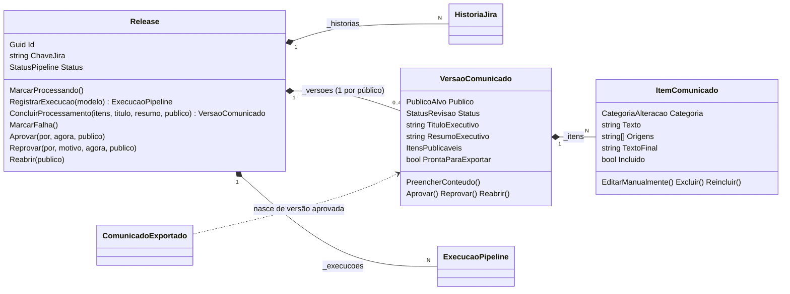

# InvoiSys.Domain — o hexágono

O centro do sistema. Aqui vivem as **regras de negócio** e os **contratos** (portas) que
o resto do sistema implementa. Este projeto **não referencia nenhum outro**, nem
ASP.NET, EF Core ou `HttpClient`. Se você precisou de um `using` de infraestrutura aqui,
o desenho está errado (ver [ADR-001](../../docs/decisoes-arquiteturais.md#adr-001--arquitetura-hexagonal-ports--adapters)).

```
InvoiSys.Domain/
├── Entities/   # entidades ricas: estado + invariantes + ciclo de vida
├── Enums/      # vocabulário fixo de negócio, com valor serializado (ParaValor)
└── Ports/      # interfaces que a infraestrutura implementa + contrato de erro
```

---

## Entidades

### Agregado `Release` (raiz)



| Entidade | Papel | Métodos que importam |
|---|---|---|
| [`Release`](Entities/Release.cs) | Raiz do agregado. Dona do ciclo de vida da **geração** (`StatusPipeline`) e porta de entrada para toda mutação de versão/item | `ConcluirProcessamento`, `Aprovar`, `Reprovar`, `Reabrir`, `EditarItem`, `ExcluirItem`, `ReincluirItem` (acham o item em qualquer versão pelo id), `PublicoDoItem`, `RegistrarExecucao`, `VersaoPara(publico)`. Atalhos da versão Cliente: `Itens`, `TituloExecutivo`, `ResumoExecutivo`, `ProntaParaExportar` |
| [`HistoriaJira`](Entities/HistoriaJira.cs) | Dado bruto do Jira. `record` **imutável**: o pipeline gera cópias limpas com `with`, nunca muta | `TextoFonte` (Release Note dedicada **ou** descrição técnica), `PossuiReleaseNoteDedicada` |
| [`VersaoComunicado`](Entities/VersaoComunicado.cs) | O comunicado **para um público**, com revisão própria (`StatusRevisao`). Responde "pode exportar?" | `Aprovar`, `Reprovar(motivo)`, `Reabrir`, `PreencherConteudo`, `EditarItem`/`ExcluirItem`/`ReincluirItem` (recusam versão aprovada, [ADR-021](../../docs/decisoes-arquiteturais.md#adr-021--item-de-versão-aprovada-não-é-editado-sem-reabrir)), `ItensPublicaveis`, `ProntaParaExportar` |
| [`ItemComunicado`](Entities/ItemComunicado.cs) | Um parágrafo do comunicado, originado de 1+ histórias | `TextoFinal` (edição humana vence), `Origens`. `EditarManualmente`, `Excluir(motivo)` e `Reincluir` são `internal`: de fora do domínio, só pela `Release` |
| [`ExecucaoPipeline`](Entities/ExecucaoPipeline.cs) | Log de uma rodada do pipeline (rastreabilidade) | `MarcarConcluida`, `MarcarFalha(erro)` |

### Agregados independentes

| Entidade | Papel |
|---|---|
| [`ComunicadoExportado`](Entities/ComunicadoExportado.cs) | Registro de publicação (append-only). **O construtor lança `ReleaseNaoAprovadaException` se a versão não estiver `ProntaParaExportar`** |
| [`Usuario`](Entities/Usuario.cs) | Quem faz login, revisa e aprova. `Papel` é texto livre até o RBAC existir. Desligar = `Desativar()`, nunca DELETE |
| [`DestaqueHero`](Entities/DestaqueHero.cs) | Conteúdo institucional da tela de login (`GET /branding/highlights`). Sem relação com o pipeline |

### Exceções de regra de negócio

| Exceção | Lançada quando |
|---|---|
| `RevisaoHumanaObrigatoriaException` | aprovar Release com pipeline em `falhou`, transição de revisão inválida, ou reprocessar versão já aprovada sem reabrir (`GarantirQuePodeReprocessar`, [ADR-020](../../docs/decisoes-arquiteturais.md#adr-020--versão-aprovada-não-é-reprocessada-sem-reabrir)) |
| `ReleaseSemItensProcessadosException` | aprovar/reprovar público sem versão gerada, ou versão sem itens |
| `VersaoSemItensException` | (interna à versão) aprovar sem itens ou com todos excluídos |
| `TransicaoDeStatusInvalidaException` | (interna à versão) ex.: reaprovar o que já foi aprovado, ou alterar item de versão aprovada |
| `ItemNaoEncontradoException` | editar/excluir/reincluir um item que não existe na Release |
| `ReleaseNaoAprovadaException` | construir `ComunicadoExportado` de versão não aprovada |
| `ReleaseNaoEncontradaException` | caso de uso aponta para uma chave de Release que não foi persistida |
| `ArgumentException` | reprovar sem motivo, aprovar/reprovar sem identificar o revisor (trilha de auditoria da revisão humana), ou editar item com texto vazio |

> Mapeamento para HTTP das exceções de revisão: ver `MapearFalhaDeRevisao` e `MapearFalhaDeRevisaoDeItem` no
> [README da API](../InvoiSys.Api/README.md#tradução-de-erro--http).

---

## Enums

Todos têm um **valor serializado** separado do nome do membro (`ParaValor()`). Assim o C#
fica em PascalCase e a API e o banco falam `snake_case`, como no contrato herdado do
Python.

| Enum | Valores | Onde |
|---|---|---|
| [`CategoriaAlteracao`](Enums/CategoriaAlteracao.cs) | `nova_funcionalidade` · `melhoria` · `correcao` · `outros`. **Fixos** | item |
| [`PublicoAlvo`](Enums/PublicoAlvo.cs) | `cliente` · `comercial` · `suporte` · `interno`. **Fixos** | versão, exportação |
| [`StatusPipeline`](Enums/StatusPipeline.cs) | `pendente` · `processando` · `aguardando_revisao` · `aprovado` · `falhou` | Release (geração) |
| [`StatusRevisao`](Enums/StatusRevisao.cs) | `aguardando_revisao` · `aprovado` · `reprovado` | versão (revisão) |
| [`StatusExecucaoPipeline`](Enums/StatusExecucaoPipeline.cs) | `iniciada` · `concluida` · `falhou` | execução |
| [`FormatoExportacao`](Enums/FormatoExportacao.cs) | `markdown` · `html` · `pdf` | exportação |

`CategoriaAlteracaoExtensions.TentarConverter` é case-insensitive de propósito, porque a
entrada é resposta de LLM. `StatusPipelineExtensions.TentarConverter` (filtro `?status=` da listagem) e
`PublicoAlvoExtensions.TentarConverter` também, e **não têm
default**: valor ausente não converte (na revisão, assumir Cliente aprovaria o público
errado em silêncio).

---

## Portas

| Porta | Tipo | Implementada por | Para quê |
|---|---|---|---|
| [`IJiraClient`](Ports/IJiraClient.cs) | saída (integração) | `JiraRestClient` / `JiraClientPendente` | `BuscarHistoriasDaReleaseAsync(fixVersion)`: todas as issues, paginação resolvida por dentro |
| [`ILlmProvider`](Ports/ILlmProvider.cs) | saída (integração) | `OpenRouterProvider` / `ProviderPendente` | um método por estágio de IA: `CategorizarAsync`, `AgruparSemelhantesAsync`, `ReescreverLinguagemNegocioAsync`, `GerarTituloEResumoAsync` |
| [`IReleaseRepository`](Ports/IReleaseRepository.cs) | persistência (agregado) | `ReleaseRepository` | `BuscarPorIdAsync`, `BuscarPorChaveJiraAsync` (agregado completo), `SalvarAsync`, `ListarResumosAsync(status?)` (devolve o modelo de leitura `ReleaseResumo`, nunca uma `Release` parcial) |
| [`IHistoriaJiraRepository`](Ports/IHistoriaJiraRepository.cs) | **somente leitura** | `HistoriaJiraRepository` | consultar histórias sem carregar o agregado |
| [`IExecucaoPipelineRepository`](Ports/IExecucaoPipelineRepository.cs) | **somente leitura** | `ExecucaoPipelineRepository` | histórico de execuções (mais recente primeiro) |
| [`IComunicadoExportadoRepository`](Ports/IComunicadoExportadoRepository.cs) | **append-only** | `ComunicadoExportadoRepository` | `AdicionarAsync`, `BuscarPorIdAsync`, `ListarPorReleaseAsync` |
| [`IUsuarioRepository`](Ports/IUsuarioRepository.cs) | persistência (agregado) | `UsuarioRepository` | `BuscarPorIdAsync`, `BuscarPorEmailAsync`, `SalvarAsync` (sem delete) |
| [`IDestaqueHeroRepository`](Ports/IDestaqueHeroRepository.cs) | somente leitura | `DestaqueHeroRepository` | `ListarAtivosAsync` (ordenado) |

**Não existe** porta para `VersaoComunicado` nem `ItemComunicado`, e isso é proposital:
aprovar, editar ou excluir passa pela `Release` carregada ([ADR-009](../../docs/decisoes-arquiteturais.md#adr-009--repository-por-agregado-portas-de-leitura-isoladas)).

### Contrato de erro das integrações

[`Ports/ExcecoesDeIntegracao.cs`](Ports/ExcecoesDeIntegracao.cs). O erro faz parte do
contrato da porta, então mora aqui, não no adapter
([ADR-013](../../docs/decisoes-arquiteturais.md#adr-013--exceções-de-integração-são-contrato-da-porta)):

```
IntegracaoExternaException (abstract) ─► 502
 ├─ JiraApiException
 ├─ LlmApiException
 └─ LlmRespostaInvalidaException
ProviderNaoConfiguradoException ─► 501
```

---

## Regras para quem for mexer aqui

- **Nunca** setar `Status = Aprovado` direto. Aprovação passa por `Aprovar()`.
- Coleções: `IReadOnlyList` público + `List` privado, mutado só por método de ciclo de
  vida.
- Propriedades com `private set`/`private init`. Construtor privado vazio só para o EF.
- `Id = Guid.NewGuid()` no construtor, sempre (e `ValueGeneratedNever()` na
  configuration, [ADR-010](../../docs/decisoes-arquiteturais.md#adr-010--ids-gerados-no-domínio-com-valuegeneratednever)).
- Nomes de negócio em **português** (vocabulário da InvoiSys).
- Testes de referência: `ReleaseInvariantesTests`, `VersaoComunicadoTests`,
  `HistoriaJiraTests`.

## O que ainda falta neste módulo

- Mapear o fluxo de recuperação de senha (token de reset com expiração), se entrar no
  escopo ([P-02](../../docs/decisoes-arquiteturais.md#p-02--desenho-da-autenticação)).
- Porta de renderização da exportação, se a opção escolhida em
  [P-03](../../docs/decisoes-arquiteturais.md#p-03--onde-mora-o-render-da-exportação)
  for essa.
